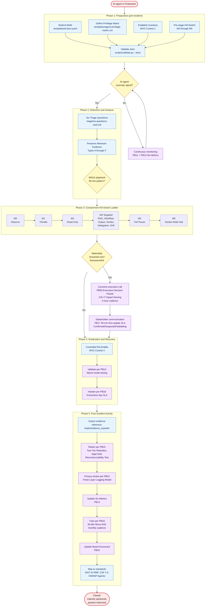
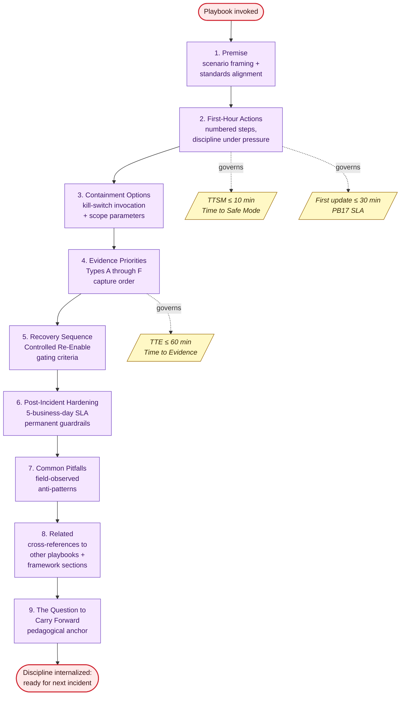

<!-- ────────────────────────────────────────────────────────────────── -->
<!--  Flow Diagrams                                                     -->
<!--  Part of the AI IR Overlay™ framework, by Jacob Ideji              -->
<!--  https://jacobideji.com                                            -->
<!--  License: Apache 2.0. See LICENSE file in this package.            -->
<!-- ────────────────────────────────────────────────────────────────── -->

# Flow Diagrams

This file collects the framework's canonical visual references. Three diagrams answer three different questions about the AI IR Overlay at v0.32.0:

1. **What lives in the repo and how the layers stack** (Component Map)
2. **How the framework runs end-to-end during an incident** (Incident Lifecycle Flow)
3. **What is inside a single playbook** (Canonical Playbook Internal Flow)

All three render natively on GitHub. The diagrams are intended as orientation aids for new readers, board-level briefings, and onboarding materials. They are not a substitute for the underlying playbooks, schemas, or framework foundation documents.

If you reference these diagrams in a presentation, slide deck, board paper, or external artifact, please retain the citation footer at the bottom of this file.

---

## Diagram 1 of 3: Framework Component Map

What lives in the repo and how the layers stack. Reads top-down: a new adopter enters at Layer 1 (Onramps), internalizes Layer 2 (Foundation), gains operational discipline at Layer 3, applies the right playbook from Layer 4, validates standards alignment via Layer 5, and runs machine-readable artifacts from Layer 6. Layer 7 governs the whole stack.

```mermaid
flowchart TB
    classDef onramp fill:#e8f4fd,stroke:#1f6feb,color:#0a3069
    classDef foundation fill:#fff4e6,stroke:#b95900,color:#3b1700
    classDef ops fill:#e6f4ea,stroke:#1a7f37,color:#0a3622
    classDef playbook fill:#f5e6ff,stroke:#6f42c1,color:#3c1568
    classDef cw fill:#fff8c5,stroke:#9a6700,color:#3d2c00
    classDef impl fill:#f6f8fa,stroke:#57606a,color:#1f2328
    classDef gov fill:#ffe9e9,stroke:#cf222e,color:#3a0f10

    subgraph L1["Layer 1: Onramps"]
        Q1["QUICKSTART.md<br/>CISO + engineer<br/>30-day path"]:::onramp
        Q2["QUICKSTART-startup.md<br/>4-week minimum-viable<br/>Maturity Level 2 target"]:::onramp
    end

    subgraph L2["Layer 2: Framework Foundation"]
        F1["framework/01<br/>Minimum Viable Overlay<br/>(4 controls)"]:::foundation
        F2["framework/02<br/>Mental Model<br/>(4 governing sentences)"]:::foundation
        F3["framework/03<br/>Maturity Roadmap<br/>(Levels 1 to 4)"]:::foundation
        F4["framework/04<br/>Materiality and Disclosure<br/>(canonical convening trigger)"]:::foundation
    end

    subgraph L3["Layer 3: Operational Disciplines"]
        O1["triage/<br/>Six Questions"]:::ops
        O2["kill-switches/<br/>M0 to M5 ladder<br/>+ 6 M3 variants"]:::ops
        O3["evidence/<br/>Minimum Evidence Set<br/>Types A through F"]:::ops
        O4["examples/<br/>Incident Walkthrough"]:::ops
    end

    subgraph L4["Layer 4: Twenty-Four Playbooks"]
        PB_F["Foundation (2)<br/>PB02 PB01"]:::playbook
        PB_P["Prevention (2)<br/>PB04 PB19"]:::playbook
        PB_C["Closure (1)<br/>PB18"]:::playbook
        PB_G["Governance (3)<br/>PB05 PB17 PB24"]:::playbook
        PB_M["Measurement and Depth (7)<br/>PB03 PB13 PB14 PB15<br/>PB16 PB22 PB23"]:::playbook
        PB_O["Operations (9)<br/>PB06 PB07 PB08 PB09<br/>PB10 PB11 PB12 PB20 PB21"]:::playbook
    end

    subgraph L5["Layer 5: Standards Crosswalks"]
        C1["NIST AI RMF 1.0"]:::cw
        C2["NIST CSF 2.0<br/>+ SP 800-61 r3"]:::cw
        C3["OWASP Top 10 for<br/>Agentic Applications 2026"]:::cw
    end

    subgraph L6["Layer 6: Machine-Readable Contracts"]
        I1["templates/<br/>AI-BoM,<br/>Privilege Matrix"]:::impl
        I2["schemas/ (5)<br/>AI-BoM, Privilege Matrix,<br/>Credential Event,<br/>Kill-Switch API,<br/>Evidence Export"]:::impl
        I3["scripts/validate.py<br/>strict + CI Action"]:::impl
        I4["reference-impls/<br/>evidence_exporter<br/>kill_switch_demo"]:::impl
    end

    subgraph L7["Layer 7: Project Governance"]
        G1["GOVERNANCE.md"]:::gov
        G2["CONTRIBUTING +<br/>CONTRIBUTORS"]:::gov
        G3["SECURITY +<br/>CODE_OF_CONDUCT"]:::gov
        G4["LICENSE Apache 2.0"]:::gov
        G5["CITATION.cff +<br/>CHANGELOG +<br/>CONTENT_MAP +<br/>RELEASE_CHECKLIST"]:::gov
    end

    L1 --> L2
    L2 --> L3
    L3 --> L4
    L4 -. maps to .-> L5
    L3 --> L6
    L4 --> L6
    L7 -. governs .-> L2
    L7 -. governs .-> L4
    L7 -. governs .-> L6
```

**How to read this diagram.** A reader entering at Layer 1 (Onramps) is not expected to internalize Layers 2 through 6 on the first read. The reading order in [`README.md`](../README.md) sequences the layers across 14 items. The QUICKSTART (Layer 1) collapses that sequence into an action-oriented path. The Component Map shows that the action path traverses the same layers; it does not skip them.

---

## Diagram 2 of 3: Incident Lifecycle Flow

How the framework runs end-to-end across the five NIST SP 800-61 r3 phases. Every node points to the specific repo artifact that drives that step. Decision diamonds mark the two convening points where the framework departs from a linear procedure: the anomaly signal at the start of Phase 2, and the materiality threshold between Phase 3 and Phase 4.

**How to read this diagram.** The five phases follow NIST SP 800-61 r3 sequencing, which is the framework's primary alignment surface. Two decision points carry disproportionate weight: the anomaly signal (Phase 1 to Phase 2 transition) gates whether the response is initiated; the materiality threshold (Phase 3 to Phase 4 transition) gates whether executive convening and disclosure obligations are triggered. The canonical convening trigger lives in [`framework/04-materiality-and-disclosure.md`](../framework/04-materiality-and-disclosure.md) and is referenced by every playbook that may invoke it.

---

## Diagram 3 of 3: Canonical Playbook Internal Flow

The nine-section skeleton every shipped playbook follows. Sections 1 through 6 are response-phase content; sections 7 through 9 are post-incident discipline. The time-budget annotations are the framework's operational SLAs as enforced through PB13 (Six Metrics), PB14 (Testing), and PB16 (Training).

**How to read this diagram.** The skeleton is the structural contract for every playbook (PB01 through PB24). The 9-section discipline is documented in [`CONTENT_MAP.md`](../CONTENT_MAP.md). The time budgets (TTSM, TTE, first-update) are not aspirational; they are the metrics reported through PB13 Six Metrics and validated through PB14 pre-production testing and PB16 monthly Micro-Drills.

---

## Source

These diagrams synthesize the framework as it stands at v0.32.0. They will be revised as the framework evolves toward v1.0.0 and as the Steering Committee announcement and external contributions land. Suggested edits are welcome via Pull Request per [`CONTRIBUTING.md`](../CONTRIBUTING.md).

*Source: AI IR Overlay framework, by Jacob Ideji.*

<https://www.linkedin.com/in/jacobideji/>
